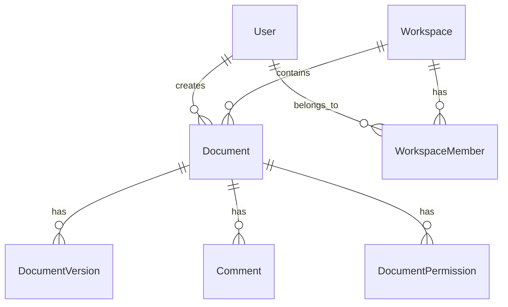

# Database Design & Schema

## Template

```markdown
## Database Design & Schema

### Data Model Overview



### Collection/Table Definitions

#### [CollectionName]

**Purpose:** [Apa yang disimpan di collection ini]
**Estimated Size:** [Jumlah dokumen yang diperkirakan]
**Growth Rate:** [Pertumbuhan per bulan/tahun]

| Field | Type | Required | Default | Description |
|-------|------|----------|---------|-------------|
| _id | ObjectId | Auto | Auto | MongoDB internal ID |
| refId | String (UUID v7) | Yes | Auto-generated | Public identifier |
| [field1] | String | Yes | — | [Description] |
| [field2] | Number | No | 0 | [Description] |
| [field3] | ObjectId (ref: [Collection]) | Yes | — | Foreign key ke [Collection] |
| [field4] | [SubDocument] | No | null | Embedded document |
| createdAt | Date | Yes | Date.now | Timestamp created |
| updatedAt | Date | Yes | Date.now | Timestamp updated |
| deletedAt | Date | No | null | Soft delete timestamp |

**Embedded Sub-Document: [SubDocument]**

| Field | Type | Description |
|-------|------|-------------|
| [subField1] | String | [Description] |
| [subField2] | Number | [Description] |

### Indexes

#### [CollectionName] Indexes

| Index Name | Fields | Type | Purpose |
|------------|--------|------|---------|
| refId_1 | { refId: 1 } | Unique | Lookup by public ID |
| [field]_1 | { [field]: 1 } | Regular | Query by [field] |
| [compound]_idx | { field1: 1, field2: 1 } | Compound | Query [use case] |
| [text]_idx | { title: "text", content: "text" } | Text | Full-text search |
| deletedAt_1 | { deletedAt: 1 } | Partial (where null) | Active records filter |

**Index Strategy Notes:**
- [Penjelasan kenapa index ini dipilih berdasarkan query patterns]
- [Trade-off: write performance vs read performance]

### Migrations

| Migration | Description | Reversible | Estimated Duration |
|-----------|-------------|------------|-------------------|
| M001 | Create [collection] with indexes | Yes (drop collection) | < 1 min |
| M002 | Add [field] to [collection] | Yes (unset field) | [Duration] |
| M003 | Backfill [field] for existing docs | Yes (unset field) | [Duration based on doc count] |

**Migration Script Example:**

```javascript
// M002: Add [field] to [collection]
db.[collection].updateMany(
  { [field]: { $exists: false } },
  { $set: { [field]: [defaultValue] } }
);

// Rollback
db.[collection].updateMany(
  {},
  { $unset: { [field]: "" } }
);
```

### Data Integrity Rules

| Rule | Enforcement | Description |
|------|-------------|-------------|
| [Rule 1] | Application level | [Detail] |
| [Rule 2] | Database level (unique index) | [Detail] |
| [Rule 3] | Application level (pre-save hook) | [Detail] |
```

## MongoDB vs SQL Considerations

### Kapan Embed vs Reference

| Pattern | Embed | Reference |
|---------|-------|-----------|
| 1:1 relationship | ✅ Embed | Jika dokumen besar |
| 1:Few (< 100) | ✅ Embed | Jika sering diakses terpisah |
| 1:Many (100-1000) | Reference | ✅ Reference |
| Many:Many | Reference | ✅ Reference (junction collection) |
| Data sering berubah | Reference | ✅ Reference |
| Data selalu diakses bersama | ✅ Embed | Jika ukuran kecil |

### Denormalization Guidelines

- Denormalize data yang sering di-read tapi jarang di-write
- Simpan "snapshot" data (e.g., user name di comment) untuk menghindari JOIN
- Update denormalized data via background job atau event handler
- Dokumentasikan semua denormalized fields dan sync mechanism

## Rules

1. ERD diagram WAJIB ada — visual representation of data relationships
2. Setiap collection HARUS punya: refId (UUID v7), createdAt, updatedAt
3. Soft delete (deletedAt) sebagai default — hard delete hanya untuk data yang benar-benar tidak perlu
4. Indexes HARUS berdasarkan actual query patterns, bukan asal tebak
5. Migration plan WAJIB ada untuk setiap schema change — termasuk rollback
6. Estimated size dan growth rate membantu capacity planning
7. Data integrity rules harus explicit — MongoDB tidak enforce foreign keys
8. Jangan over-index — setiap index menambah write overhead
9. Compound index order matters — most selective field first
10. Text indexes untuk search — tapi pertimbangkan dedicated search engine untuk scale besar
