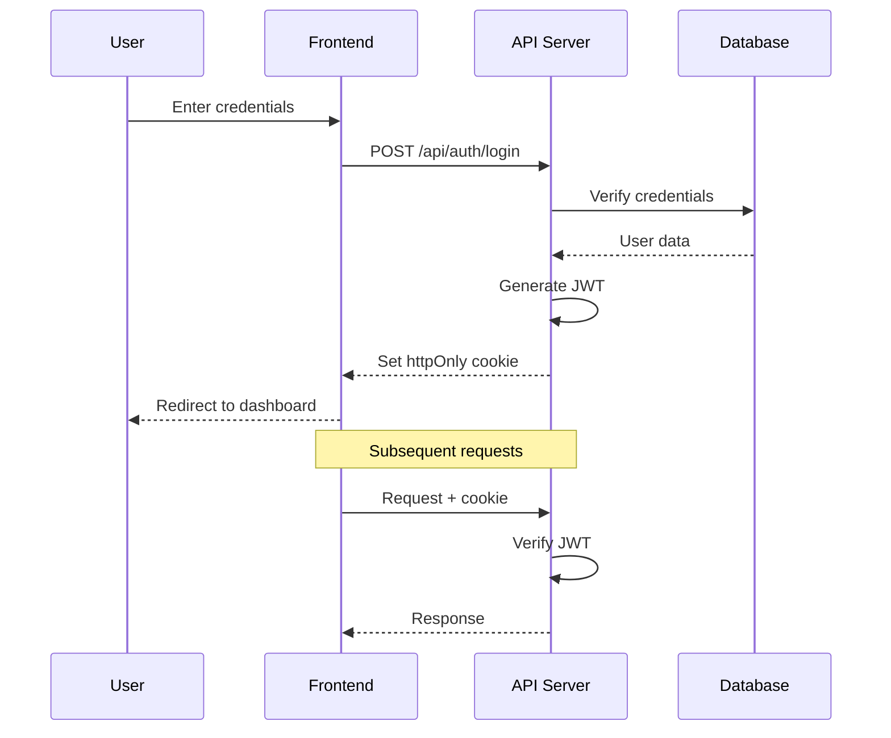

# Security & Authorization

## Template

```markdown
## Security & Authorization

### Authentication Flow



[Jelaskan authentication flow secara detail. Include token lifecycle,
refresh strategy, dan session management.]

### Authorization Model

| Resource | Action | Admin | Workspace Admin | Contributor | Viewer |
|----------|--------|-------|-----------------|-------------|--------|
| [Resource 1] | Create | ✅ | ✅ | ✅ | ❌ |
| [Resource 1] | Read | ✅ | ✅ | ✅ | ✅ |
| [Resource 1] | Update | ✅ | ✅ | ✅ | ❌ |
| [Resource 1] | Delete | ✅ | ✅ | ❌ | ❌ |
| [Resource 2] | Create | ✅ | ✅ | ❌ | ❌ |

### Permission Check Flow

```
Request → Middleware (JWT verify) → Route Handler → Permission Check → Business Logic
```

```javascript
// Pseudo-code permission check
async function checkPermission(userId, resourceId, requiredLevel) {
  // 1. Check if user is admin (bypass all)
  // 2. Check workspace membership
  // 3. Check resource-level permission
  // 4. Return allowed/denied
}
```

### Data Security

| Data Type | At Rest | In Transit | Access Control |
|-----------|---------|------------|----------------|
| Passwords | bcrypt hash (12 rounds) | HTTPS | Never exposed in API |
| JWT tokens | httpOnly cookie | HTTPS | Secure flag, SameSite |
| User PII | [Encryption method] | HTTPS | Role-based access |
| Documents | [Encryption method] | HTTPS | Permission-based |
| File uploads | [Storage encryption] | HTTPS | Signed URLs |

### Security Checklist

**Authentication:**
- [ ] Passwords hashed dengan bcrypt (min 12 rounds)
- [ ] JWT di httpOnly cookie (bukan localStorage)
- [ ] Token expiration dan refresh strategy
- [ ] Rate limiting pada login endpoint
- [ ] Account lockout setelah N failed attempts
- [ ] Secure password reset flow

**Authorization:**
- [ ] Permission check di setiap API endpoint
- [ ] Role-based access control (RBAC)
- [ ] Resource-level permission (document permission)
- [ ] Workspace isolation (data antar workspace terisolasi)

**Input Validation:**
- [ ] Server-side validation untuk semua input
- [ ] Sanitize HTML input (prevent XSS)
- [ ] Validate file upload types dan sizes
- [ ] SQL/NoSQL injection prevention
- [ ] Path traversal prevention

**Transport Security:**
- [ ] HTTPS only (redirect HTTP → HTTPS)
- [ ] Security headers (CSP, HSTS, X-Frame-Options)
- [ ] CORS configuration (whitelist origins)
- [ ] Cookie flags (Secure, HttpOnly, SameSite)

**Audit & Monitoring:**
- [ ] Log authentication events (login, logout, failed attempts)
- [ ] Log authorization failures
- [ ] Log sensitive data access
- [ ] Alerting untuk suspicious activity
```

## Rules

1. Authentication flow diagram WAJIB ada — termasuk token lifecycle
2. Authorization matrix WAJIB ada — role × resource × action
3. Permission check harus di server-side, BUKAN hanya di frontend
4. Passwords WAJIB di-hash (bcrypt, min 12 rounds) — NEVER store plaintext
5. JWT di httpOnly cookie — NEVER di localStorage (XSS vulnerable)
6. Rate limiting WAJIB pada authentication endpoints
7. Input validation di server-side — client-side validation hanya UX, bukan security
8. Security headers harus dikonfigurasi (CSP, HSTS, X-Frame-Options, dll)
9. Audit logging untuk semua security-sensitive operations
10. Workspace isolation harus di-enforce di database query level
