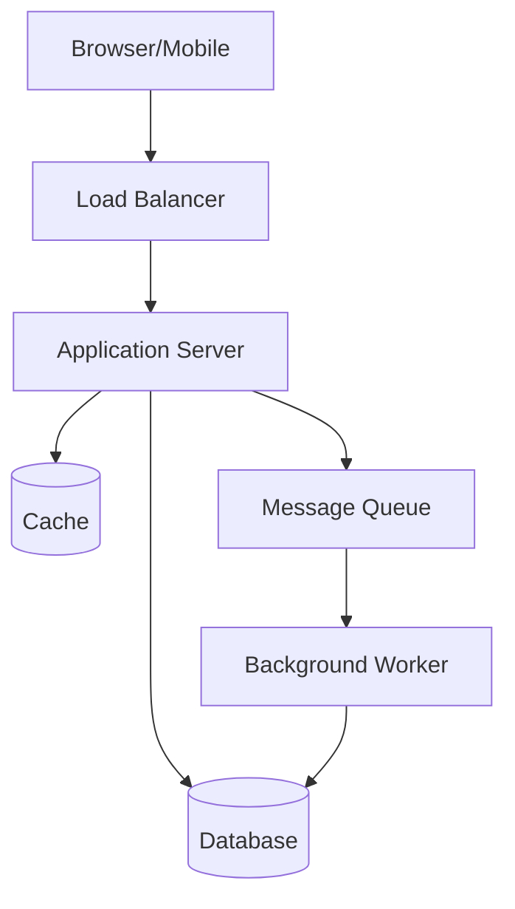
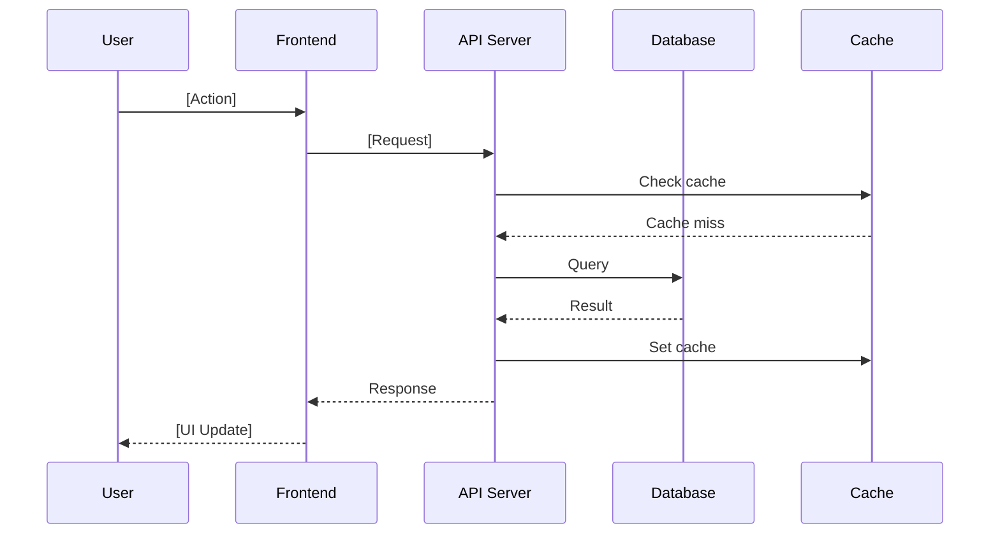

# System Architecture

## Template

```markdown
## System Architecture

### High-Level Architecture



[Jelaskan arsitektur secara high-level. Komponen apa saja yang terlibat,
bagaimana mereka berkomunikasi, dan di mana fitur baru ini masuk.]

### Component Diagram

| Component | Responsibility | Technology | Changes Required |
|-----------|---------------|------------|------------------|
| [Component 1] | [Apa yang dilakukan] | [Tech stack] | New / Modified / None |
| [Component 2] | [Responsibility] | [Tech] | [Change type] |
| [Component 3] | [Responsibility] | [Tech] | [Change type] |

### New Components (jika ada)

```markdown
#### [Nama Component Baru]

**Purpose:** [Mengapa component ini dibutuhkan]
**Technology:** [Tech stack yang digunakan]
**Interface:** [Bagaimana component ini berkomunikasi dengan yang lain]
**Deployment:** [Di mana dan bagaimana di-deploy]
```

### Data Flow



[Jelaskan data flow untuk use case utama. Sertakan happy path dan error path.]

### Service Boundaries

[Jika microservices, jelaskan service mana yang bertanggung jawab untuk apa.
Jika monolith, jelaskan module/layer boundaries.]

```markdown
| Service/Module | Owns | Depends On |
|----------------|------|------------|
| [Service A] | [Data/domain yang dimiliki] | [Service B, Service C] |
| [Service B] | [Data/domain] | [External API] |
```

### Integration Points

| Integration | Protocol | Direction | Auth | Error Handling |
|-------------|----------|-----------|------|----------------|
| [Service A → B] | REST/gRPC/Event | Sync/Async | [JWT/API Key] | [Retry/Circuit Breaker] |
| [App → External] | REST | Sync | [API Key] | [Timeout + Fallback] |
```

## Diagram Types yang Harus Ada

| Diagram | Kapan Wajib | Tool |
|---------|-------------|------|
| High-level architecture | Selalu | Mermaid / draw.io |
| Sequence diagram | Jika ada multi-component interaction | Mermaid |
| Component diagram | Jika ada new/modified components | Mermaid / draw.io |
| Data flow diagram | Jika data flow complex | Mermaid |
| State diagram | Jika ada state machine / workflow | Mermaid |

## Rules

1. Architecture diagram WAJIB ada — minimal high-level
2. Sequence diagram untuk setiap use case utama (happy path + error path)
3. Component table harus jelas: apa yang NEW, MODIFIED, atau UNCHANGED
4. Data flow harus include caching, error handling, dan async operations
5. Service boundaries harus jelas — siapa owns apa
6. Integration points harus define: protocol, auth, dan error handling
7. Jangan over-architect — desain untuk kebutuhan saat ini + reasonable growth
